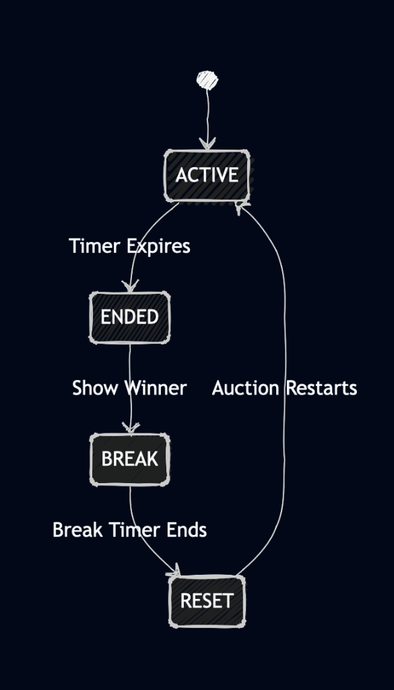

# Real-Time Auction System

## Overview

This project is a **real-time auction platform** designed to handle concurrent bidding with correctness, fairness, and instant synchronization. The system treats the server as the single source of truth for all auction states, timers, and bid validations.

The primary engineering focus is on **real-time behavior**, **race-condition handling**, and **state synchronization**, rather than typical CRUD features.

- **Live Demo (Frontend)**: [https://levich-internship-challenge-phi.vercel.app](https://levich-internship-challenge-phi.vercel.app)
- **Live Server (Backend)**: [https://levich-internship-challenge-vd39.onrender.com](https://levich-internship-challenge-vd39.onrender.com)

---

## Features

- **Live Bidding**: Real-time bid updates via Socket.io with immediate UI reflection.
- **Race Condition Handling**: Server-side synchronous processing ensures only valid bids are accepted even under heavy concurrency.
- **Independent Lifecycle**: Each auction item operates on its own independent timer and break cycle.
- **User Identity**: Frontend-only identity system with a "Change Identity" chip in the dashbaord.
- **Responsive Dashboard**: Adaptive grid layout with a polished, centered design.
- **Global Status Bar**: Real-time summary of active auctions and those ending soon.
- **Smart Notifications**:
  - **Winning Badge**: Green "You're Winning" indicator for the highest bidder.
  - **Outbid Badge**: Red "Outbid" indicator immediately alerting users when they lose the lead.
  - **Visual Cues**: Amber borders for "Ending Soon" and red pulsing text for critical countdowns.
- **Auction Results**: End-of-auction banner displaying the winner and final price.
- **Automatic Restart**: Self-healing demo loop where each item resets automatically after its own break period.

---

### System Architecture

<p align="center">
  
  <br>
  <em>High-level architecture showing real-time socket communication.</em>
</p>


### 1. Server-Authoritative Time
The system relies entirely on **server time** for auction duration and state transitions. Clients passively receive time updates. This prevents client-side manipulation (e.g., changing system clock) from affecting the auction logic.

### 2. Synchronous Bid Processing (Race Condition Handling)
To handle race conditions (e.g., two users bidding the same amount simultaneously):
- The server processes incoming `BID_PLACED` events synchronously in a single-threaded Node.js event loop.
- The first valid bid processed updates the state.
- **Example**: If User A ($50) and User B ($50) hit the server at the exact same millisecond, Node.js event loop picks one first. The second bid sees the new price ($50) and is rejected ($50 <= $50) with an `OUTBID` error.

### 3. Independent Item Lifecycle
To demonstrate scalability and realism, each auction item runs independently:
- **Active Phase**: Varied durations (30s to 2.5m) to ensure staggering finishes.
- **Break Phase**: When an individual item ends, it enters a 60-second cool-down period.
- **Reset Phase**: After its specific break, the item automatically re-initializes while others may still be active.

### 4. Frontend-Only Identity
To keep the system lightweight and focused on real-time mechanics:
- No database authentication is used.
- Users are prompted for a **Display Name** on first load.
- This name is stored in `sessionStorage` to persist across page reloads.
- This serves as the `bidderId` for distinguishing users in the auction logic.

---

## Auction Lifecycle

<p align="center">
  
  <br>
  <em>Lifecycle of a single auction item from start to reset.</em>
</p>

1.  **Initialization**: Items load with specific, staggered end times.
2.  **Bidding**: Users place bids. Highest bid is broadcasted to all.
3.  **End**: When `serverTime >= endTime` for a specific item, that auction closes.
4.  **Result**: The final state is locked. A "Winner" banner overlays the item card.
5.  **Restart Loop**: That specific item waits for its break duration, then resets and restarts automatically.


## Project Structure

```
.
├── backend/              # Node.js + Express + Socket.io
│   ├── server.js        # Entry point (HTTP server + Interval Loop)
│   ├── app.js           # Express app configuration
│   ├── socket.js        # Socket.io event handlers (Business Logic)
│   └── auctionStore.js  # In-memory single-source-of-truth state
├── frontend/            # React + Vite
│   ├── src/
│   │   ├── components/  # Smart UI Components (AuctionItemCard, etc.)
│   │   ├── pages/       # Page views
│   │   ├── lib/         # API & Socket utilities
│   │   └── hooks/       # Custom hooks (e.g., useServerNow)
│   └── .env.local       # Environment configuration
└── package.json         # Root dependencies
```

---

## API & Socket Events

### REST API
- `GET /items`: Returns initial state `{ serverTime, items: [] }`.

### Socket.io Events

| Event | Direction | Payload | Description |
|-------|-----------|---------|-------------|
| `BID_PLACED` | Client → Server | `{ itemId, amount, bidderId }` | User attempts to place a bid. |
| `UPDATE_BID` | Server → All | `{ itemId, currentBid, ... }` | Broadcasts new highest bid/bidder to everyone. |
| `OUTBID` | Server → Client | `{ itemId, reason }` | Sent privately to a user if their bid was rejected (too low). |
| `BID_ERROR` | Server → Client | `{ reason, message }` | Sent on validation failure (auction ended, invalid amount). |

---

## Getting Started

### 1. Backend Setup
```bash
# Install dependencies
npm install

# Start development server (port 3000)
npm run dev
```

### 2. Frontend Setup
```bash
cd frontend

# Install dependencies
npm install

# Configure Environment
cp .env.example .env.local
```

**Edit `.env.local`**:
```env
# For local development:
VITE_BACKEND_URL=http://localhost:3000

# For production (if pointing to live backend):
VITE_BACKEND_URL=https://levich-internship-challenge-vd39.onrender.com
```

```bash
# Start frontend (port 5173)
npm run dev
```

---

## Deployment Notes

- **Backend**: Deployed on **Render**. It enforces strict CORS settings, allowing requests only from `localhost:5173` and the Vercel production domain.
- **Frontend**: Deployed on **Vercel**. It uses `import.meta.env.VITE_BACKEND_URL` to connect to the backend, ensuring no hardcoded localhost URLs leak into production.

---

## Scope Clarification / Non-Goals
The following features were intentionally excluded to maintain focus on the core real-time synchronization challenge:
- **Authentication**: No email/password or JWT complexity.
- **Persistence**: No database (Redis/Postgres); state is in-memory for speed and simplicity.
- **Admin Tools**: No dashboard for creating items manually.

---

## How to Test
- [ ] **Open Multiple Clients**: Open the [Live Demo](https://levich-internship-challenge-phi.vercel.app) in two different browser windows (or Incognito mode).
- [ ] **Identity Check**: Set unique names (e.g. "User A", "User B").
- [ ] **Concurrent Bidding**: Place bids on the same item from both windows.
- [ ] **Verify Sync**: Confirm prices update instantly and status badges (Winning/Outbid) reflect the correct state.
- [ ] **Race Condition Check**: Try to bid simultaneously; only the first valid bid will be accepted.
- [ ] **Lifecycle Verify**: Watch items end and auto-restart independently after their break period.
